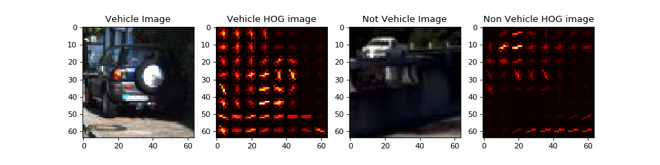
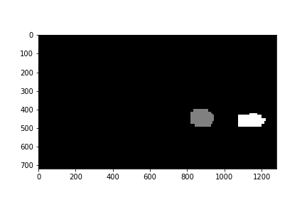

## Thomas J. Chmielenski

##### P5 - Vehicle Detecion Project
##### September 25, 2017

---
**Goals**

The goals / steps of this project are the following:

* Perform a Histogram of Oriented Gradients (HOG) feature extraction on a labeled training set of images and train a classifier Linear SVM classifier
* Optionally, you can also apply a color transform and append binned color features, as well as histograms of color, to your HOG feature vector. 
* Note: for those first two steps don't forget to normalize your features and randomize a selection for training and testing.
* Implement a sliding-window technique and use your trained classifier to search for vehicles in images.
* Run your pipeline on a video stream (start with the test_video.mp4 and later implement on full project_video.mp4) and create a heat map of recurring detections frame by frame to reject outliers and follow detected vehicles.
* Estimate a bounding box for vehicles detected.


## [Rubric](https://review.udacity.com/#!/rubrics/513/view) Points
Here I will consider the rubric points individually and describe how I addressed each point in my implementation.  

---
#### 1. Provide a Writeup / README that includes all the rubric points and how you addressed each one.  You can submit your writeup as markdown or pdf.  [Here](https://github.com/udacity/CarND-Vehicle-Detection/blob/master/writeup_template.md) is a template writeup for this project you can use as a guide and a starting point.  

You're reading it!  The code that compliments this writeup can be found here:`P5-CarND-Vehicle-Detection.ipynb` in this same repository.

### Histogram of Oriented Gradients (HOG)

#### 1. Explain how (and identify where in your code) you extracted HOG features from the training images.

The code for this step is contained in the `Histogram of Oriented Gradients (HOG) Feature Extraction` section of the IPython notebook.  

I started by reading in all the `vehicle` and `non-vehicle` images from the small set of images.

  Here is an example of one of each of the `vehicle` and `non-vehicle` classes:


In the small dataset, the number of  `vehicle` and `non-vehicle` images were not equal with 1196, and 1125 respectively.
In the larger dataset, the number of  `vehicle` and `non-vehicle` images were not equal either with 8792, and 8968 respectively.
The two classes should have roughly the same amount of images to avoid any bias.   However, I created
a `balance_classes` function, to equalize the number of classes by duplicating images
in the non-dominant class.

```python
Before Class Balancing:
  Number of Vehicles in training set:  8792
  Number of Non Vehicels in training set:  8968

After Class Balancing:
  Number of Vehicles in training set:  8968
  Number of Non Vehicels in training set:  8968

```

I then explored different color spaces and different `skimage.hog()` parameters (`orientations`, `pixels_per_cell`, and `cells_per_block`).  I grabbed random images from each of the two classes and displayed them to get a feel for what the `skimage.hog()` output looks like.
Using hog features, we can almost make out some of the features of the vehicles, such as tail lights, license plates,
and overall shape.

Here is an example using the `YCrCb` color space and HOG parameters of `orientations=8`, `pixels_per_cell=(8, 8)` and `cells_per_block=(2, 2)`:


Here is an example of using 8x8, 16x16, 32x32, and 64x64 spatial binning:


Here is an example of separating the color histogram into 8, 16, 32, and 64 bins using the YCrCb colorspace.


#### 2. Explain how you settled on your final choice of HOG parameters.

I started manually experimentating with varius colorspaces, orientations,
hog_channels, as well as spatial sizes, and color histogram bins.  Accuracy
ranged from 93 to 100%, but I couldn't get a good feel for how each 
of these parameters contributed to the overall accuracy.  

After eliminating a couple of obvious parameters (discussed in parameter details
below) I decided to try the brute force method of looping each of the reamining parameters
to obtain compute and train times, feature vector lengths, and accuracy.
I experimented with using both the 1000 random images and with the full small dataset. 
I was hoping to be able to see patterns that clearly identified a pattern as to which parameters 
where the optimal for this task.  Unfortunately,  no such pattern emerged.  

My experimentation code can be found in `Appendix B:` in the jupyter notebook and I listed a couple of my
trials are listed in a table at the end of this document.

From these trials, I extrapoled the top five parameter combinations 
interpolated.  I will start with the YCrCb, and will fall back on the others 
if necessary.

| cspace | orient | pix_per_cell | cell_per_block | hog_channel | spatial_size | hist_bins | computeTime | feature_length | train_time | accuracy |
| --- | --- | --- | --- | --- | --- | --- | --- | --- | --- | --- |
|YCrCb| 	7	|8|	2|	0|	 (32, 32)| 	64|	7.9|	4636|	3.68|	0.9979|
|YUV| 	7	|8|	2|	1|	 (16, 16)| 	32|	6.98|	2236|	1.5|	1|
|YUV| 	8|	8|	2|	2|	 (16, 16)| 	64|	7.09|	2528|	1.79|	0.9958|
|HLS| 	9|	8|	2|	1|	 (16, 16)| 	64|	7.29|	2724|	1.89|	0.9979|
|LUV| 	9|	8|	2|	2|	 (16, 16)| 	64|	7.28|	2724|	1.93|	0.9979|

The accuracy achieved on the small dataset was near perfect and I was under the impression that
it would be easy to identify cars in the video easily with this accuracy.
Unfortunately, it wasn't until after I realized that I was only using the small dataset, and not
the larger dataset with accuracy dropping down slightly to around 98%.

When detecting vehicles in the video frames, I tried the five parameter combinations above, but 
the `YCrCb` colorspace appeared to have the been results.

From my experimentation , coupled with a number of manual tweaks, here are the final parameters I ended up with:
```python
color_space = 'YCrCb' 
orient = 9
pix_per_cell = 8
cell_per_block = 2
hog_channel = 'ALL' 
spatial_size = (32,32)  # Spatial binning dimensions
hist_bins = 32  # Number of histogram bins
spatial_feat: True
hist_feat: True
hog_feat: True
use_small_dataset: False
```
 
Below are some of my notes on each of these parameters:

**colorspaces (`color_space = 'YCrCb`)**:
We know from the previous project, that 'RGB' colorspace
doesn't work very well with various lighting and shadow conditions. Thus, we can 
easily ignore this colorspace. From my testing, `YCrCb` and 'YUV` colorspaces since to
give the most accurate results in my testing.

**orientation (`orient = 9`)**: 
This is the number of orientation bins that the 
gradient information will be split up into in the histogram. Typical values are 
between 6 and 12 bins.  however research shows that 
improvements taper off after 9 bins.  Experimentation suggests somewhere between
7 and 9 orientations is best for this task.

**pixels per cell (`pix_per_cell = 8`)**:
This parameter represents the size of features, such as tail lights or license plates 
in vehicles, we are looking to focus on. 8 x 8 pixels should be a good size 
for our use case of detecting vehicles in a scene.

**cells per block (`cells_per_block = 2`)**: 
This parameter specifices how the histogram counts will be normalized.  2 x 2 cells
should be enough to normalize lighting and shadowns in the images.

**hog channel(s) (`hog_channel ='ALL'`)**:
This parameter controls whether to use one of the 3 color channels or to use all of them.
My early experimentation shows that usually one channel was better than all 3 channels.
The lectures notes and video suggests that using 'ALL' would produce better results
than a single channel.  Later tweaks when performing on the video frames, suggested 'ALL'
worked better.

**spatial size (`spatial_size= 32x32`)**:
This parameter downsamples the image. I experimented using a size 64x64 pixels, however, the feature vector 
length increases over 10,000.  The feature vector length gets larger than 8,000, the training time 
increases sufficiently.  Spatial sizes of 16x16 and 32x32 seems work well without drastically 
increases the feature spatial length.

**histogram bins (`hist_bins = 32`)**:  
This parameter controls how many bins the color histogram channels are broken up into.
The larger number of bins, the higher the accuracy.  Although, I didn't see much different
using 32 over 64 bins.


#### 3. Describe how (and identify where in your code) you trained a classifier using your selected HOG features (and color features if you used them).

The code for this step is contained in the `Training the Classifier` section of the IPython notebook.  

I trained a linear SVM using the LinearSVC function using the `YCrCb` colorspace, 
`9`  orientations, `8` pixels per cell and `2` cells per block, using the balanced 8968 
`vehicle` and 8968 `non-vehicle` images taken from the given larger dataset.

It took approx 2min, 24 seconds to compute the features from the car and notcar images, and
only 28 seconds to train the SVC.  The feature vector length was 8460 which is managable
size for our task. Test Accuracy of SVC was 98.8%.


### Sliding Window Search

#### 1. Describe how (and identify where in your code) you implemented a sliding window search.  How did you decide what scales to search and how much to overlap windows?

The code for this step is contained in the `Sliding Windows` section of the IPython notebook.  

I chose a `y_start_stop = [400, 656]` as my min and max pixels in the `y` direction to 
search in slide_window().  The minimum value avoids unnecessary searching in the sky for
vehicles.  The maximum was chose as an offset of 256 pixels from the start, which is an integer 
multiple of the cell size.

In addition, I chose a sliding window size of 96x96 with a 50% overlap.  


#### 2. Show some examples of test images to demonstrate how your pipeline is working.  What did you do to optimize the performance of your classifier?

Here are some sliding windows on the given test images:


Sliding windows were very slow, and we could use scaling to achieve the same effect, therefore, 
I searched on 3 scales to search the video frames for vehicles:

| ystart | ystop | scale | Comment |
|--------|-------|-------|---------|
| 400 | 528 | 1.0 | find vehicle in off in a distance|
| 400 | 592 | 1.5 | find vehicles in mid range |
| 596 | 656 | 2.5 | find vehicles closest to the camera frame|


### Video Implementation

#### 1. Provide a link to your final video output.  Your pipeline should perform reasonably well on the entire project video (somewhat wobbly or unstable bounding boxes are ok as long as you are identifying the vehicles most of the time with minimal false positives.)
Here's a [link to my video result](./output_videos/project_video_output.mp4)


#### 2. Describe how (and identify where in your code) you implemented some kind of filter for false positives and some method for combining overlapping bounding boxes.

I recorded the bound box positions of positive detections for each of the 3 scales and add them to together.  Then
created a heatmap for bounding box positions, I then append them to a global `heatmaps` deque which will save
the last 10 heatmaps.  I then sum the currently stored heatmaps and apply a threshold of 30 heatmap to help
avoid false positives within a given frame.   The `scipy.ndimage.measurements.label()` function takes in a heatmap
and creates one bounding box for each vehicle and I then returned this marked in the `process_image` pipeline._


### Here are six frames and their corresponding heatmaps:


### Here is the output of `scipy.ndimage.measurements.label()` on the integrated heatmap from all six frames:



### Here the resulting bounding boxes are drawn onto the last frame in the series:


**Note:**  These six frames are taken from the 37-42 second mark in the video, taken 1 second apart.

---

### Discussion

#### 1. Briefly discuss any problems / issues you faced in your implementation of this project.  Where will your pipeline likely fail?  What could you do to make it more robust?

To complete this project, I followed along with the class videos, as well as the 
[Self-Driving Car Project Q&A | Vehicle Tracking](https://www.youtube.com/watch?v=P2zwrTM8ueA&list=PLAwxTw4SYaPkz3HerxrHlu1Seq8ZA7-5P&index=4)
and read up on the forums.   

Experimenting with parameters is fun as well as challenging.  I would have liked to have seen more explicit results when changing parameters and
see patterns emerge from the brute forced method of trying every combination. Getting the right combinations of parameters is time consuming
and doesn't generalize to other videos very well.

While this was a good project, we have a long road ahead (no pun intended), as this pipeline is very 
inefficient and is useless in a real life self-driving vehicle.  It is taking about 30 minutes to proces the
test video which is 50 seconds long!

So if I had more time, I would experiment with changing the 'C' parameter on the LinearSVC classifier.  
I might even try a decision tree  or naive-bayes algorithms, but I am guessing from the lectures, 
they wouldn't perform as well.

I also struggled with finding the right scales, the correct number of heatmaps to retain, and apply the right 
thresholds to avoid the false positives that appear. 

I would also like to combine this project with the previous project!

---

### Appendix - Experimentation Data

Here are the results of trail #1 (full small training set) with over a accuracy > 99.5%:  

| color_space | orient | pix_per_cell | cell_per_block | hog_channel | spatial_size | hist_bins | computeTime | feature_length | train_time | accuracy |
| --- | --- | --- | --- | --- | --- | --- | --- | --- | --- | --- |
| HSV | 6 | 8 | 2 | 1 | (16, 16) | 64 | 6.9 | 2136 | 1.35 | 0.9979 |
| HSV | 6 | 8 | 2 | 2 | (32, 32) | 64 | 7.54 | 4440 | 3.24 | 0.9958 |
| HSV | 7 | 8 | 2 | 2 | (32, 32) | 16 | 7.76 | 4492 | 3.9 | 0.9958 |
| HSV | 9 | 8 | 2 | 2 | (16, 16) | 64 | 7.53 | 2724 | 1.88 | 0.9958 |
| HSV | 9 | 8 | 2 | 2 | (32, 32) | 64 | 7.81 | 5028 | 4.17 | 0.9958 |
| LUV | 7 | 8 | 2 | 0 | (16, 16) | 32 | 7.03 | 2236 | 1.53 | 0.9958 |
| LUV | 7 | 8 | 2 | 1 | (16, 16) | 64 | 7.42 | 2332 | 1.49 | 0.9958 |
| LUV | 7 | 8 | 2 | 1 | (32, 32) | 32 | 7.85 | 4540 | 4.02 | 0.9958 |
| LUV | 9 | 8 | 2 | 0 | (16, 16) | 64 | 7.28 | 2724 | 2.03 | 0.9958 |
| HLS | 6 | 8 | 2 | 0 | (32, 32) | 64 | 7.26 | 4440 | 3.33 | 0.9958 |
| HLS | 7 | 8 | 2 | 1 | (32, 32) | 64 | 7.34 | 4636 | 2.9 | 0.9958 |
| YUV | 7 | 8 | 2 | 1 | (16, 16) | 32 | 6.98 | 2236 | 1.5 | 1.0 |
| YUV | 8 | 8 | 2 | 2 | (32, 32) | 64 | 7.39 | 4832 | 3.48 | 0.9958 |
| YUV | 9 | 8 | 2 | 2 | (16, 16) | 32 | 7.3 | 2628 | 2.0 | 0.9958 |
| YCrCb | 7 | 8 | 2 | 0 | (32, 32) | 64 | 7.48 | 4636 | 3.48 | 0.9958 |
| YCrCb | 9 | 8 | 2 | 0 | (16, 16) | 64 | 7.2 | 2724 | 1.98 | 0.9958 |
| YCrCb | 9 | 8 | 2 | 2 | (32, 32) | 64 | 7.88 | 5028 | 3.95 | 0.9958 |


Here are the results of trail #2 (full set):  

| cspace | orient | pix_per_cell | cell_per_block | hog_channel | spatial_size | hist_bins | computeTime | feature_length | train_time | accuracy |
| --- | --- | --- | --- | --- | --- | --- | --- | --- | --- | --- |
| LUV | 7 | 8 | 2 | 0 | (32, 32) | 64 | 7.34 | 4636 | 3.5 | 0.9958 |
| LUV | 7 | 8 | 2 | 2 | (32, 32) | 64 | 7.26 | 4636 | 3.34 | 0.9958 |
| LUV | 9 | 8 | 2 | 2 | (32, 32) | 64 | 7.4 | 5028 | 3.86 | 0.9958 |
| HLS | 9 | 8 | 2 | 1 | (16, 16) | 64 | 7.48 | 2724 | 2.2 | 1.0 |
| YUV | 8 | 8 | 2 | 1 | (16, 16) | 64 | 7.04 | 2528 | 1.64 | 0.9958 |
| YUV | 8 | 8 | 2 | 2 | (16, 16) | 64 | 7.09 | 2528 | 1.79 | 0.9958 |
| YUV | 9 | 8 | 2 | 0 | (16, 16) | 64 | 7.27 | 2724 | 1.98 | 0.9958 |
| YCrCb | 6 | 8 | 2 | 1 | (16, 16) | 32 | 6.79 | 2040 | 1.3 | 0.9958 |​
| YCrCb | 7 | 8 | 2 | 0 | (32, 32) | 64 | 7.9 | 4636 | 3.68 | 0.9979 |
| YCrCb | 9 | 8 | 2 | ALL | (16, 16) | 32 | 16.33 | 6156 | 5.44 | 0.9958 |

Here are the results of trail #3 (full set):  

| cspace | orient | pix_per_cell | cell_per_block | hog_channel | spatial_size | hist_bins | computeTime | feature_length | train_time | accuracy |
| --- | --- | --- | --- | --- | --- | --- | --- | --- | --- | --- |
| HSV | 7 | 8 | 2 | 0 | (16, 16) | 64 | 6.88 | 2332 | 1.49 | 0.9958 |
| HSV | 7 | 8 | 2 | ALL | (16, 16) | 32 | 15.94 | 4980 | 4.06 | 0.9958 |
| HSV | 8 | 8 | 2 | 0 | (32, 32) | 64 | 7.34 | 4832 | 3.74 | 0.9958 |
| HSV | 9 | 8 | 2 | 1 | (16, 16) | 64 | 7.21 | 2724 | 1.83 | 0.9958 |
| LUV | 8 | 8 | 2 | 1 | (16, 16) | 32 | 7.02 | 2432 | 1.72 | 0.9958 |
| LUV | 9 | 8 | 2 | 1 | (32, 32) | 32 | 7.45 | 4932 | 4.0 | 0.9958 |
| LUV | 9 | 8 | 2 | 2 | (16, 16) | 64 | 7.28 | 2724 | 1.93 | 0.9979 |
| HLS | 6 | 8 | 2 | 1 | (16, 16) | 64 | 6.73 | 2136 | 1.29 | 0.9958 |
| HLS | 8 | 8 | 2 | 1 | (16, 16) | 32 | 7.01 | 2432 | 1.74 | 0.9958 |
| HLS | 9 | 8 | 2 | 1 | (16, 16) | 64 | 7.29 | 2724 | 1.89 | 0.9979 |
| YUV | 6 | 8 | 2 | ALL | (32, 32) | 64 | 15.58 | 6792 | 2.13 | 0.9979 |
| YUV | 7 | 8 | 2 | 1 | (16, 16) | 32 | 6.9 | 2236 | 1.44 | 0.9958 |
| YUV | 7 | 8 | 2 | 1 | (32, 32) | 64 | 7.35 | 4636 | 3.4 | 0.9979 |
| YUV | 7 | 8 | 2 | 2 | (32, 32) | 32 | 7.37 | 4540 | 3.69 | 0.9958 |
| YUV | 9 | 8 | 2 | 1 | (16, 16) | 64 | 7.26 | 2724 | 1.85 | 0.9979 |
| YCrCb | 9 | 8 | 2 | 2 | (32, 32) | 64 | 7.3 | 5028 | 3.73 | 0.9958 |

