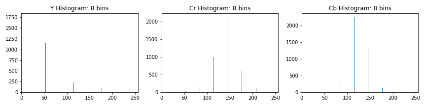

## Thomas J. Chmielenski

##### P5 - Vehicle Detecion Project
##### September 25, 2017

---
**Goals**

The goals / steps of this project are the following:

* Perform a Histogram of Oriented Gradients (HOG) feature extraction on a labeled training set of images and train a classifier Linear SVM classifier
* Optionally, you can also apply a color transform and append binned color features, as well as histograms of color, to your HOG feature vector. 
* Note: for those first two steps don't forget to normalize your features and randomize a selection for training and testing.
* Implement a sliding-window technique and use your trained classifier to search for vehicles in images.
* Run your pipeline on a video stream (start with the test_video.mp4 and later implement on full project_video.mp4) and create a heat map of recurring detections frame by frame to reject outliers and follow detected vehicles.
* Estimate a bounding box for vehicles detected.


## [Rubric](https://review.udacity.com/#!/rubrics/513/view) Points
Here I will consider the rubric points individually and describe how I addressed each point in my implementation.  

---
#### 1. Provide a Writeup / README that includes all the rubric points and how you addressed each one.  You can submit your writeup as markdown or pdf.  [Here](https://github.com/udacity/CarND-Vehicle-Detection/blob/master/writeup_template.md) is a template writeup for this project you can use as a guide and a starting point.  

You're reading it!  The code that compliments this writeup can be found here:`P5-CarND-Vehicle-Detection.ipynb` in this same repository.

### Histogram of Oriented Gradients (HOG)

#### 1. Explain how (and identify where in your code) you extracted HOG features from the training images.

The code for this step is contained in the `Histogram of Oriented Gradients (HOG) Feature Extraction` section of the IPython notebook.  

I started by reading in all the `vehicle` and `non-vehicle` images.  Here is an example of one of each of the `vehicle` and `non-vehicle` classes:


The number of  `vehicle` and `non-vehicle` images were not equal with 1196, and 1125 respectivately.
The two classes could have roughly the same amount of images to avoid any bias.  I created
a `balance_classes` function, to equalize the number of classes by duplicating images
in the non-dominant class.

```python
Before Class Balancing:
  Number of Vehicles in training set:  8792
  Number of Non Vehicels in training set:  8968

After Class Balancing:
  Number of Vehicles in training set:  8968
  Number of Non Vehicels in training set:  8968

```

I then explored different color spaces and different `skimage.hog()` parameters (`orientations`, `pixels_per_cell`, and `cells_per_block`).  I grabbed random images from each of the two classes and displayed them to get a feel for what the `skimage.hog()` output looks like.


Here is an example using the `YCrCb` color space and HOG parameters of `orientations=8`, `pixels_per_cell=(8, 8)` and `cells_per_block=(2, 2)`:
|YCrCb| 	7	|8|	2|	0|	 (32, 32)| 	64|	7.9|	4636|	3.68|	0.9979|





#### 2. Explain how you settled on your final choice of HOG parameters.

I started manually experimentating with different colorspaces, orientations,
hog_channels, as well as spatial sizes, and color histogram bins.  Accuracy
ranged from 93 to 100%, but I couldn't get a good feel for how each 
of these parameters contributed to the overall accuracy.  

After eliminating a couple of obvious parameters (discussed in parameter details
below) I decided to try the brute force method of looping each of the reamining parameters
to obtain compute and train times, feature vector lengths, and accuracy.
I experimented with using 1000 random images as well as the full training
set.  I was hoping to be able to see patterns that clearly identified
a pattern as to which parameters where the optimal for this task.  Unfortunately,
no such pattern emerged.  

My experimentation code can be found in `Appendix B:` in the jupyter notebook.

Here are the results of trail #1 (full training set) with over a accuracy > 99.5%:  

| color_space | orient | pix_per_cell | cell_per_block | hog_channel | spatial_size | hist_bins | computeTime | feature_length | train_time | accuracy |
| --- | --- | --- | --- | --- | --- | --- | --- | --- | --- | --- |
| HSV | 6 | 8 | 2 | 1 | (16, 16) | 64 | 6.9 | 2136 | 1.35 | 0.9979 |
| HSV | 6 | 8 | 2 | 2 | (32, 32) | 64 | 7.54 | 4440 | 3.24 | 0.9958 |
| HSV | 7 | 8 | 2 | 2 | (32, 32) | 16 | 7.76 | 4492 | 3.9 | 0.9958 |
| HSV | 9 | 8 | 2 | 2 | (16, 16) | 64 | 7.53 | 2724 | 1.88 | 0.9958 |
| HSV | 9 | 8 | 2 | 2 | (32, 32) | 64 | 7.81 | 5028 | 4.17 | 0.9958 |
| LUV | 7 | 8 | 2 | 0 | (16, 16) | 32 | 7.03 | 2236 | 1.53 | 0.9958 |
| LUV | 7 | 8 | 2 | 1 | (16, 16) | 64 | 7.42 | 2332 | 1.49 | 0.9958 |
| LUV | 7 | 8 | 2 | 1 | (32, 32) | 32 | 7.85 | 4540 | 4.02 | 0.9958 |
| LUV | 9 | 8 | 2 | 0 | (16, 16) | 64 | 7.28 | 2724 | 2.03 | 0.9958 |
| HLS | 6 | 8 | 2 | 0 | (32, 32) | 64 | 7.26 | 4440 | 3.33 | 0.9958 |
| HLS | 7 | 8 | 2 | 1 | (32, 32) | 64 | 7.34 | 4636 | 2.9 | 0.9958 |
| YUV | 7 | 8 | 2 | 1 | (16, 16) | 32 | 6.98 | 2236 | 1.5 | 1.0 |
| YUV | 8 | 8 | 2 | 2 | (32, 32) | 64 | 7.39 | 4832 | 3.48 | 0.9958 |
| YUV | 9 | 8 | 2 | 2 | (16, 16) | 32 | 7.3 | 2628 | 2.0 | 0.9958 |
| YCrCb | 7 | 8 | 2 | 0 | (32, 32) | 64 | 7.48 | 4636 | 3.48 | 0.9958 |
| YCrCb | 9 | 8 | 2 | 0 | (16, 16) | 64 | 7.2 | 2724 | 1.98 | 0.9958 |
| YCrCb | 9 | 8 | 2 | 2 | (32, 32) | 64 | 7.88 | 5028 | 3.95 | 0.9958 |


Here are the results of trail #2 (full set):  

| cspace | orient | pix_per_cell | cell_per_block | hog_channel | spatial_size | hist_bins | computeTime | feature_length | train_time | accuracy |
| --- | --- | --- | --- | --- | --- | --- | --- | --- | --- | --- |
| LUV | 7 | 8 | 2 | 0 | (32, 32) | 64 | 7.34 | 4636 | 3.5 | 0.9958 |
| LUV | 7 | 8 | 2 | 2 | (32, 32) | 64 | 7.26 | 4636 | 3.34 | 0.9958 |
| LUV | 9 | 8 | 2 | 2 | (32, 32) | 64 | 7.4 | 5028 | 3.86 | 0.9958 |
| HLS | 9 | 8 | 2 | 1 | (16, 16) | 64 | 7.48 | 2724 | 2.2 | 1.0 |
| YUV | 8 | 8 | 2 | 1 | (16, 16) | 64 | 7.04 | 2528 | 1.64 | 0.9958 |
| YUV | 8 | 8 | 2 | 2 | (16, 16) | 64 | 7.09 | 2528 | 1.79 | 0.9958 |
| YUV | 9 | 8 | 2 | 0 | (16, 16) | 64 | 7.27 | 2724 | 1.98 | 0.9958 |
| YCrCb | 6 | 8 | 2 | 1 | (16, 16) | 32 | 6.79 | 2040 | 1.3 | 0.9958 |​
| YCrCb | 7 | 8 | 2 | 0 | (32, 32) | 64 | 7.9 | 4636 | 3.68 | 0.9979 |
| YCrCb | 9 | 8 | 2 | ALL | (16, 16) | 32 | 16.33 | 6156 | 5.44 | 0.9958 |

Here are the results of trail #3 (full set):  

| cspace | orient | pix_per_cell | cell_per_block | hog_channel | spatial_size | hist_bins | computeTime | feature_length | train_time | accuracy |
| --- | --- | --- | --- | --- | --- | --- | --- | --- | --- | --- |
| HSV | 7 | 8 | 2 | 0 | (16, 16) | 64 | 6.88 | 2332 | 1.49 | 0.9958 |
| HSV | 7 | 8 | 2 | ALL | (16, 16) | 32 | 15.94 | 4980 | 4.06 | 0.9958 |
| HSV | 8 | 8 | 2 | 0 | (32, 32) | 64 | 7.34 | 4832 | 3.74 | 0.9958 |
| HSV | 9 | 8 | 2 | 1 | (16, 16) | 64 | 7.21 | 2724 | 1.83 | 0.9958 |
| LUV | 8 | 8 | 2 | 1 | (16, 16) | 32 | 7.02 | 2432 | 1.72 | 0.9958 |
| LUV | 9 | 8 | 2 | 1 | (32, 32) | 32 | 7.45 | 4932 | 4.0 | 0.9958 |
| LUV | 9 | 8 | 2 | 2 | (16, 16) | 64 | 7.28 | 2724 | 1.93 | 0.9979 |
| HLS | 6 | 8 | 2 | 1 | (16, 16) | 64 | 6.73 | 2136 | 1.29 | 0.9958 |
| HLS | 8 | 8 | 2 | 1 | (16, 16) | 32 | 7.01 | 2432 | 1.74 | 0.9958 |
| HLS | 9 | 8 | 2 | 1 | (16, 16) | 64 | 7.29 | 2724 | 1.89 | 0.9979 |
| YUV | 6 | 8 | 2 | ALL | (32, 32) | 64 | 15.58 | 6792 | 2.13 | 0.9979 |
| YUV | 7 | 8 | 2 | 1 | (16, 16) | 32 | 6.9 | 2236 | 1.44 | 0.9958 |
| YUV | 7 | 8 | 2 | 1 | (32, 32) | 64 | 7.35 | 4636 | 3.4 | 0.9979 |
| YUV | 7 | 8 | 2 | 2 | (32, 32) | 32 | 7.37 | 4540 | 3.69 | 0.9958 |
| YUV | 9 | 8 | 2 | 1 | (16, 16) | 64 | 7.26 | 2724 | 1.85 | 0.9979 |
| YCrCb | 9 | 8 | 2 | 2 | (32, 32) | 64 | 7.3 | 5028 | 3.73 | 0.9958 |

From these three trials, here are the top five parameter combinations 
interpolated.  I will start with the YCrCb, and will fall back on the others 
if necessary.

| cspace | orient | pix_per_cell | cell_per_block | hog_channel | spatial_size | hist_bins | computeTime | feature_length | train_time | accuracy |
| --- | --- | --- | --- | --- | --- | --- | --- | --- | --- | --- |
|YCrCb| 	7	|8|	2|	0|	 (32, 32)| 	64|	7.9|	4636|	3.68|	0.9979|
|YUV| 	7	|8|	2|	1|	 (16, 16)| 	32|	6.98|	2236|	1.5|	1|
|YUV| 	8|	8|	2|	2|	 (16, 16)| 	64|	7.09|	2528|	1.79|	0.9958|
|HLS| 	9|	8|	2|	1|	 (16, 16)| 	64|	7.29|	2724|	1.89|	0.9979|
|LUV| 	9|	8|	2|	2|	 (16, 16)| 	64|	7.28|	2724|	1.93|	0.9979|


From my experimentation , here is the final parameters I ended up with:

**colorspaces (`color_space`)**:
We know from the previous project, that 'RGB' colorspace
doesn't work very well with various lighting and shadow conditions. Thus, we can 
easily ignore this colorspace. From my testing, `YCrCb` and 'YUV` colorspaces since to
give the most accurate results in my testing.

**orientation (`orient`)**: 
This is the number of orientation bins that the 
gradient information will be split up into in the histogram. Typical values are 
between 6 and 12 bins.  Values are typical between 6 and 12 bins, however
improvements taper off after 9 bins.  Experimentation suggests somewhere between
7 and 9 orientations is best for this task.

**pixels per cell (`pix_per_cell = 8`)**:
This parameter represents the size of features, such as tail lights or license plates 
in vehicles, we are looking to focus on. 8 x 8 pixels should be a good size 
for our use case of detecting vehicles in a scene.

**cells per block (`cells_per_block = 2`)**: 
This parameter specifices how the histogram counts will be normalized.  2 x 2 cells
should be enough to normalize lighting and shadowns in the images.

**hog channel(s) (`hog_channel =`)**:
This parameter controls whether to use one of the 3 color channels or to use all of them.
The lectures notes and video suggests that using 'ALL' would produce better results
than a single channel.  My expimentation did not show this behavior.

**spatial size (`spatial_size`)**:
This parameter resize downsamples the image I experimented using a size 64x64 pixels, however, the feature vector length increases
over 10,000.  The feature vector length gets larger than 8,000, the training time 
increases sufficiently.  Spatial sizes of 16x16 and 32x32 seems work well without drastically 
increases the feature spatial length.

**histogram bins (`hist_bins` = 64)**:  
This parameter controls how many bins the color histogram channels are broken up into.
The larger number of bins, the higher the accuracy.  


I tried various combinations of parameters and...


#### 3. Describe how (and identify where in your code) you trained a classifier using your selected HOG features (and color features if you used them).

The code for this step is contained in the `Training the Classifier` section of the IPython notebook.  

I trained a linear SVM using the LinearSVC function using the `YCrCb` colorspace, 
`7`  orientations, `8` pixels per cell and `2` cells per block, using 1196 
`vehicle` and 1196 `non-vehicle` images.

It took approx 14 seconds to compute the features from the car and notcar images, and
only 3-4 seconds to train the SVC.  The feature vector length was 4636 which is managable
size for our task.


### Sliding Window Search

#### 1. Describe how (and identify where in your code) you implemented a sliding window search.  How did you decide what scales to search and how much to overlap windows?

The code for this step is contained in the `Sliding Windows` section of the IPython notebook.  

I chose a `y_start_stop = [400,656]` as my min and max pixels in the `y` direction to 
search in slide_window().  The minimum value avoids unnecessary searching in the sky for
vehicles.  The maximum was chose as 256 pixels from the start, which is an integer 
multiple of the cell size.

I chose a sliding window size of 96x96 with a 50% overlap.  


#### 2. Show some examples of test images to demonstrate how your pipeline is working.  What did you do to optimize the performance of your classifier?

Ultimately I searched on two scales using YCrCb 3-channel HOG features plus 
spatially binned color and histograms of color in the feature vector, which 
provided a nice result.  

Here are running sliding windows on the given test images:


### Video Implementation

####1. Provide a link to your final video output.  Your pipeline should perform reasonably well on the entire project video (somewhat wobbly or unstable bounding boxes are ok as long as you are identifying the vehicles most of the time with minimal false positives.)
Here's a [link to my video result](./project_video.mp4)


####2. Describe how (and identify where in your code) you implemented some kind of filter for false positives and some method for combining overlapping bounding boxes.

I recorded the positions of positive detections in each frame of the video.  From the positive detections I created a heatmap and then thresholded that map to identify vehicle positions.  I then used `scipy.ndimage.measurements.label()` to identify individual blobs in the heatmap.  I then assumed each blob corresponded to a vehicle.  I constructed bounding boxes to cover the area of each blob detected.  

Here's an example result showing the heatmap from a series of frames of video, the result of `scipy.ndimage.measurements.label()` and the bounding boxes then overlaid on the last frame of video:

### Here are six frames and their corresponding heatmaps:

![alt text][image5]

### Here is the output of `scipy.ndimage.measurements.label()` on the integrated heatmap from all six frames:
![alt text][image6]

### Here the resulting bounding boxes are drawn onto the last frame in the series:
![alt text][image7]


---

###Discussion

####1. Briefly discuss any problems / issues you faced in your implementation of this project.  Where will your pipeline likely fail?  What could you do to make it more robust?

Here I'll talk about the approach I took, what techniques I used, what worked and why, where the pipeline might fail and how I might improve it if I were going to pursue this project further.  

Trial #1 (1000 Random)

| cspace | orient | pix_per_cell | cell_per_block | hog_channel | spatial_size | hist_bins | computeTime | feature_length | train_time | accuracy |
| --- | --- | --- | --- | --- | --- | --- | --- | --- | --- | --- |
| YCrCb | 6 | 8 | 2 | ALL | (32, 32) | 32 | 13.29 | 6696 | 6.16 | 0.995 |
| YCrCb | 6 | 8 | 2 | ALL | (64, 64) | 16 | 12.67 | 15864 | 16.85 | 0.995 |
| YCrCb | 7 | 8 | 2 | ALL | (16, 16) | 32 | 12.77 | 4980 | 4.27 | 0.995 |
| YCrCb | 9 | 8 | 2 | ALL | (16, 16) | 32 | 13.19 | 6156 | 5.82 | 1.0 |
| YCrCb | 9 | 8 | 2 | ALL | (32, 32) | 64 | 13.01 | 8556 | 7.98 | 1.0 |
| YCrCb | 9 | 8 | 2 | ALL | (64, 64) | 16 | 13.0 | 17628 | 20.51 | 0.995 |

| YCrCb | 5 | 8 | 2 | ALL | (32, 32) | 32 | 12.52 | 6108 | 5.41 | 0.99 |
| YCrCb | 6 | 8 | 2 | ALL | (32, 32) | 64 | 12.84 | 6792 | 5.65 | 0.9825 |
| YCrCb | 7 | 8 | 2 | ALL | (32, 32) | 16 | 12.77 | 7236 | 7.08 | 0.98 |
| YCrCb | 8 | 8 | 2 | ALL | (32, 32) | 32 | 12.87 | 7872 | 7.33 | 0.985 |

Trial #2 (1000 Random)

| YCrCb | 5 | 8 | 2 | ALL | (32, 32) | 32 | 12.66 | 6108 | 5.44 | 0.995 |
| YCrCb | 6 | 8 | 2 | ALL | (32, 32) | 64 | 12.78 | 6792 | 6.29 | 0.9975 |
| YCrCb | 7 | 8 | 2 | ALL | (16, 16) | 32 | 12.83 | 4980 | 4.48 | 0.995 |
| YCrCb | 7 | 8 | 2 | ALL | (32, 32) | 16 | 12.87 | 7236 | 7.19 | 0.995 |
| YCrCb | 8 | 8 | 2 | ALL | (32, 32) | 32 | 12.86 | 7872 | 8.0 | 0.9975 |
| YCrCb | 9 | 8 | 2 | ALL | (32, 32) | 64 | 13.12 | 8556 | 7.58 | 0.99 |

Trial #3 (All)

| YCrCb | 5 | 8 | 2 | ALL | (32, 32) | 64 | 14.92 | 6204 | 4.85 | 0.9937 |
| YCrCb | 6 | 8 | 2 | ALL | (64, 64) | 64 | 14.91 | 16008 | 5.9 | 0.9916 |
*| YCrCb | 7 | 8 | 2 | ALL | (32, 32) | 16 | 15.22 | 7236 | 6.5 | 0.9875 |
**| YCrCb | 9 | 8 | 2 | ALL | (32, 32) | 64 | 15.5 | 8556 | 7.29 | 0.9875 |

Trial #4 (All)

| YCrCb | 5 | 8 | 2 | ALL | (16, 16) | 32 | 15.57 | 3804 | 2.85 | 0.9896 |
| YCrCb | 5 | 8 | 2 | ALL | (32, 32) | 64 | 15.01 | 6204 | 4.94 | 0.9896 |
| YCrCb | 6 | 8 | 2 | ALL | (64, 64) | 64 | 15.04 | 16008 | 15.49 | 0.9896 |
| YCrCb | 9 | 8 | 2 | ALL | (32, 32) | 32 | 15.89 | 8460 | 7.37 | 0.9896 |

Trial #5 (All)

| YCrCb | 5 | 8 | 2 | 0 | (16, 16) | 64 | 6.59 | 1940 | 1.1 | 0.9958 |
| YCrCb | 5 | 8 | 2 | 2 | (16, 16) | 32 | 6.62 | 1844 | 1.01 | 0.9979 |
| YCrCb | 5 | 8 | 2 | ALL | (16, 16) | 64 | 15.38 | 3900 | 2.65 | 0.9896 |
| YCrCb | 5 | 8 | 2 | ALL | (32, 32) | 64 | 22.18 | 6204 | 6.92 | 0.9916 |
| YCrCb | 6 | 8 | 2 | ALL | (32, 32) | 64 | 14.98 | 6792 | 5.28 | 0.9958 |
| YCrCb | 7 | 8 | 2 | 0 | (32, 32) | 64 | 7.11 | 4636 | 3.49 | 0.9958 |
| YCrCb | 7 | 8 | 2 | 1 | (16, 16) | 64 | 6.88 | 2332 | 1.45 | 0.9916 |
| YCrCb | 7 | 8 | 2 | 1 | (32, 32) | 64 | 7.05 | 4636 | 3.52 | 0.9916 |
| YCrCb | 7 | 8 | 2 | 2 | (32, 32) | 64 | 7.03 | 4636 | 3.32 | 0.9958 |
| YCrCb | 8 | 8 | 2 | 0 | (16, 16) | 32 | 6.78 | 2432 | 1.74 | 0.9916 |
| YCrCb | 8 | 8 | 2 | 0 | (16, 16) | 64 | 6.81 | 2528 | 1.66 | 0.9958 |
| YCrCb | 8 | 8 | 2 | 0 | (32, 32) | 64 | 6.98 | 4832 | 3.62 | 0.9958 |
| YCrCb | 8 | 8 | 2 | 1 | (16, 16) | 64 | 6.8 | 2528 | 1.64 | 0.9916 |
| YCrCb | 8 | 8 | 2 | 2 | (32, 32) | 32 | 7.02 | 4736 | 3.49 | 0.9979 |
| YCrCb | 9 | 8 | 2 | 0 | (32, 32) | 64 | 7.09 | 5028 | 3.84 | 0.9937 |
| YCrCb | 9 | 8 | 2 | 1 | (16, 16) | 64 | 6.91 | 2724 | 1.79 | 0.9937 |
| YCrCb | 9 | 8 | 2 | 1 | (32, 32) | 16 | 6.99 | 4884 | 4.2 | 0.9916 |
| YCrCb | 9 | 8 | 2 | ALL | (32, 32) | 64 | 15.4 | 8556 | 7.64 | 0.9916 |

Remaining Trial #1

| YCrCb | 5 | 8 | 2 | ALL | (16, 16) | 16 | 15.12 | 3756 | 3.23 | 0.9825 |
| YCrCb | 5 | 8 | 2 | ALL | (16, 16) | 32 | 13.1 | 3804 | 3.03 | 0.9875 |
| YCrCb | 5 | 8 | 2 | ALL | (32, 32) | 16 | 12.57 | 6060 | 5.54 | 0.985 |
| YCrCb | 5 | 8 | 2 | ALL | (32, 32) | 64 | 12.62 | 6204 | 5.21 | 0.9925 |
| YCrCb | 5 | 8 | 2 | ALL | (64, 64) | 32 | 12.44 | 15324 | 14.56 | 0.98 |
| YCrCb | 5 | 8 | 2 | ALL | (64, 64) | 64 | 12.35 | 15420 | 14.35 | 0.9825 |
| YCrCb | 6 | 8 | 2 | ALL | (16, 16) | 16 | 12.71 | 4344 | 3.88 | 0.9825 |
| YCrCb | 6 | 8 | 2 | ALL | (16, 16) | 32 | 12.76 | 4392 | 3.71 | 0.99 |
| YCrCb | 6 | 8 | 2 | ALL | (16, 16) | 64 | 12.85 | 4488 | 3.45 | 0.9925 |
| YCrCb | 6 | 8 | 2 | ALL | (32, 32) | 16 | 13.65 | 6648 | 6.21 | 0.9875 |
| YCrCb | 6 | 8 | 2 | ALL | (64, 64) | 32 | 12.61 | 15912 | 16.53 | 0.985 |
| YCrCb | 6 | 8 | 2 | ALL | (64, 64) | 64 | 12.61 | 16008 | 8.39 | 0.9925 |
| YCrCb | 7 | 8 | 2 | ALL | (16, 16) | 16 | 12.77 | 4932 | 4.62 | 0.985 |
| YCrCb | 7 | 8 | 2 | ALL | (16, 16) | 64 | 12.79 | 5076 | 4.11 | 0.99 |
| YCrCb | 7 | 8 | 2 | ALL | (32, 32) | 32 | 12.77 | 7284 | 6.92 | 0.985 |
| YCrCb | 7 | 8 | 2 | ALL | (32, 32) | 64 | 12.78 | 7380 | 6.54 | 0.9925 |
| YCrCb | 7 | 8 | 2 | ALL | (64, 64) | 16 | 12.83 | 16452 | 17.17 | 0.99 |
| YCrCb | 7 | 8 | 2 | ALL | (64, 64) | 32 | 12.78 | 16500 | 17.46 | 0.9925 |
| YCrCb | 7 | 8 | 2 | ALL | (64, 64) | 64 | 12.81 | 16596 | 16.53 | 0.985 |
| YCrCb | 8 | 8 | 2 | ALL | (16, 16) | 16 | 12.91 | 5520 | 5.25 | 0.9775 |
| YCrCb | 8 | 8 | 2 | ALL | (16, 16) | 32 | 12.88 | 5568 | 4.93 | 0.9825 |
| YCrCb | 8 | 8 | 2 | ALL | (16, 16) | 64 | 13.03 | 5664 | 4.64 | 0.9925 |
| YCrCb | 8 | 8 | 2 | ALL | (32, 32) | 16 | 13.02 | 7824 | 7.8 | 0.9825 |
| YCrCb | 8 | 8 | 2 | ALL | (32, 32) | 64 | 12.9 | 7968 | 7.29 | 0.9925 |
| YCrCb | 8 | 8 | 2 | ALL | (64, 64) | 16 | 12.83 | 17040 | 18.0 | 0.9875 |
| YCrCb | 8 | 8 | 2 | ALL | (64, 64) | 32 | 12.87 | 17088 | 4.51 | 0.9825 |
| YCrCb | 8 | 8 | 2 | ALL | (64, 64) | 64 | 12.86 | 17184 | 17.38 | 0.99 |
| YCrCb | 9 | 8 | 2 | ALL | (16, 16) | 16 | 13.09 | 6108 | 5.61 | 0.975 |
| YCrCb | 9 | 8 | 2 | ALL | (16, 16) | 64 | 13.15 | 6252 | 5.6 | 0.9925 |
| YCrCb | 9 | 8 | 2 | ALL | (32, 32) | 16 | 13.28 | 8412 | 8.5 | 0.9825 |
| YCrCb | 9 | 8 | 2 | ALL | (32, 32) | 32 | 13.1 | 8460 | 8.35 | 0.99 |
| YCrCb | 9 | 8 | 2 | ALL | (64, 64) | 32 | 13.03 | 17676 | 19.85 | 0.9875 |
| YCrCb | 9 | 8 | 2 | ALL | (64, 64) | 64 | 13.07 | 17772 | 18.28 | 0.9925 |


| cspace | orient | pix_per_cell | cell_per_block | hog_channel | spatial_size | hist_bins | computeTime | feature_length | train_time | accuracy |
| --- | --- | --- | --- | --- | --- | --- | --- | --- | --- | --- |
| YCrCb | 5 | 8 | 2 | ALL | (16, 16) | 16 | 13.69 | 3756 | 3.3 | 0.9825 |
| YCrCb | 5 | 8 | 2 | ALL | (16, 16) | 32 | 12.71 | 3804 | 3.33 | 0.9925 |
| YCrCb | 5 | 8 | 2 | ALL | (16, 16) | 64 | 13.19 | 3900 | 3.12 | 0.9925 |
| YCrCb | 5 | 8 | 2 | ALL | (32, 32) | 16 | 12.7 | 6060 | 5.54 | 0.975 |
| YCrCb | 5 | 8 | 2 | ALL | (32, 32) | 32 | 12.66 | 6108 | 5.44 | 0.995 |
| YCrCb | 5 | 8 | 2 | ALL | (32, 32) | 64 | 12.73 | 6204 | 5.4 | 0.9975 |
| YCrCb | 5 | 8 | 2 | ALL | (64, 64) | 16 | 12.45 | 15276 | 16.16 | 0.9925 |
| YCrCb | 5 | 8 | 2 | ALL | (64, 64) | 32 | 12.39 | 15324 | 15.53 | 0.9725 |
| YCrCb | 5 | 8 | 2 | ALL | (64, 64) | 64 | 12.36 | 15420 | 15.61 | 0.9925 |
| YCrCb | 6 | 8 | 2 | ALL | (16, 16) | 16 | 12.76 | 4344 | 4.14 | 0.9875 |
| YCrCb | 6 | 8 | 2 | ALL | (16, 16) | 32 | 12.85 | 4392 | 3.98 | 0.9775 |
| YCrCb | 6 | 8 | 2 | ALL | (16, 16) | 64 | 13.08 | 4488 | 3.57 | 0.9775 |
| YCrCb | 6 | 8 | 2 | ALL | (32, 32) | 16 | 12.92 | 6648 | 6.36 | 0.99 |
| YCrCb | 6 | 8 | 2 | ALL | (32, 32) | 32 | 12.76 | 6696 | 6.35 | 0.9875 |
| YCrCb | 6 | 8 | 2 | ALL | (32, 32) | 64 | 12.78 | 6792 | 6.29 | 0.9975 |
| YCrCb | 6 | 8 | 2 | ALL | (64, 64) | 16 | 12.9 | 15864 | 17.03 | 0.99 |
| YCrCb | 6 | 8 | 2 | ALL | (64, 64) | 32 | 12.89 | 15912 | 16.36 | 0.98 |
| YCrCb | 6 | 8 | 2 | ALL | (64, 64) | 64 | 12.64 | 16008 | 16.37 | 0.9875 |
| YCrCb | 7 | 8 | 2 | ALL | (16, 16) | 16 | 12.7 | 4932 | 4.79 | 0.985 |
| YCrCb | 7 | 8 | 2 | ALL | (16, 16) | 32 | 12.83 | 4980 | 4.48 | 0.995 |
| YCrCb | 7 | 8 | 2 | ALL | (16, 16) | 64 | 12.92 | 5076 | 4.53 | 0.99 |
| YCrCb | 7 | 8 | 2 | ALL | (32, 32) | 16 | 12.87 | 7236 | 7.19 | 0.995 |
| YCrCb | 7 | 8 | 2 | ALL | (32, 32) | 32 | 12.98 | 7284 | 7.13 | 0.9925 |
| YCrCb | 7 | 8 | 2 | ALL | (32, 32) | 64 | 12.77 | 7380 | 7.06 | 0.9925 |
| YCrCb | 7 | 8 | 2 | ALL | (64, 64) | 16 | 13.02 | 16452 | 16.73 | 0.975 |
| YCrCb | 7 | 8 | 2 | ALL | (64, 64) | 32 | 12.82 | 16500 | 16.63 | 0.98 |
| YCrCb | 7 | 8 | 2 | ALL | (64, 64) | 64 | 12.75 | 16596 | 17.3 | 0.9925 |
| YCrCb | 8 | 8 | 2 | ALL | (16, 16) | 16 | 12.88 | 5520 | 5.78 | 0.99 |
| YCrCb | 8 | 8 | 2 | ALL | (16, 16) | 32 | 13.03 | 5568 | 5.52 | 0.985 |
| YCrCb | 8 | 8 | 2 | ALL | (16, 16) | 64 | 12.86 | 5664 | 4.97 | 0.99 |
| YCrCb | 8 | 8 | 2 | ALL | (32, 32) | 16 | 12.9 | 7824 | 7.71 | 0.985 |
| YCrCb | 8 | 8 | 2 | ALL | (32, 32) | 32 | 12.86 | 7872 | 8.0 | 0.9975 |
| YCrCb | 8 | 8 | 2 | ALL | (32, 32) | 64 | 13.06 | 7968 | 7.33 | 0.9875 |
| YCrCb | 8 | 8 | 2 | ALL | (64, 64) | 16 | 12.99 | 17040 | 17.19 | 0.9925 |
| YCrCb | 8 | 8 | 2 | ALL | (64, 64) | 32 | 12.86 | 17088 | 19.14 | 0.99 |
| YCrCb | 8 | 8 | 2 | ALL | (64, 64) | 64 | 12.83 | 17184 | 18.31 | 0.9925 |
| YCrCb | 9 | 8 | 2 | ALL | (16, 16) | 16 | 13.2 | 6108 | 6.56 | 0.985 |
| YCrCb | 9 | 8 | 2 | ALL | (16, 16) | 32 | 13.44 | 6156 | 5.83 | 0.9925 |
| YCrCb | 9 | 8 | 2 | ALL | (16, 16) | 64 | 13.66 | 6252 | 5.54 | 0.9875 |
| YCrCb | 9 | 8 | 2 | ALL | (32, 32) | 16 | 13.46 | 8412 | 8.63 | 0.985 |
| YCrCb | 9 | 8 | 2 | ALL | (32, 32) | 32 | 13.24 | 8460 | 8.54 | 0.9925 |
| YCrCb | 9 | 8 | 2 | ALL | (32, 32) | 64 | 13.12 | 8556 | 7.58 | 0.99 |
| YCrCb | 9 | 8 | 2 | ALL | (64, 64) | 16 | 13.02 | 17628 | 18.9 | 0.99 |
| YCrCb | 9 | 8 | 2 | ALL | (64, 64) | 32 | 13.11 | 17676 | 19.02 | 0.99 |
| YCrCb | 9 | 8 | 2 | ALL | (64, 64) | 64 | 13.0 | 17772 | 18.45 | 0.99 |


| color_space | orient | pix_per_cell | cell_per_block | hog_channel | spatial_size | hist_bins | computeTime | feature_length | train_time | accuracy |
| --- | --- | --- | --- | --- | --- | --- | --- | --- | --- | --- |
| HSV | 6 | 8 | 2 | 1 | (16, 16) | 64 | 6.9 | 2136 | 1.35 | 0.9979 |
| HSV | 6 | 8 | 2 | 2 | (32, 32) | 64 | 7.54 | 4440 | 3.24 | 0.9958 |
| HSV | 7 | 8 | 2 | 2 | (32, 32) | 16 | 7.76 | 4492 | 3.9 | 0.9958 |
| HSV | 9 | 8 | 2 | 2 | (16, 16) | 64 | 7.53 | 2724 | 1.88 | 0.9958 |
| HSV | 9 | 8 | 2 | 2 | (32, 32) | 64 | 7.81 | 5028 | 4.17 | 0.9958 |
| LUV | 7 | 8 | 2 | 0 | (16, 16) | 32 | 7.03 | 2236 | 1.53 | 0.9958 |
| LUV | 7 | 8 | 2 | 1 | (16, 16) | 64 | 7.42 | 2332 | 1.49 | 0.9958 |
| LUV | 7 | 8 | 2 | 1 | (32, 32) | 32 | 7.85 | 4540 | 4.02 | 0.9958 |
| LUV | 9 | 8 | 2 | 0 | (16, 16) | 64 | 7.28 | 2724 | 2.03 | 0.9958 |
| HLS | 6 | 8 | 2 | 0 | (32, 32) | 64 | 7.26 | 4440 | 3.33 | 0.9958 |
| HLS | 7 | 8 | 2 | 1 | (32, 32) | 64 | 7.34 | 4636 | 2.9 | 0.9958 |
| YUV | 7 | 8 | 2 | 1 | (16, 16) | 32 | 6.98 | 2236 | 1.5 | 1.0 |
| YUV | 8 | 8 | 2 | 2 | (32, 32) | 64 | 7.39 | 4832 | 3.48 | 0.9958 |
| YUV | 9 | 8 | 2 | 2 | (16, 16) | 32 | 7.3 | 2628 | 2.0 | 0.9958 |
| YCrCb | 7 | 8 | 2 | 0 | (32, 32) | 64 | 7.48 | 4636 | 3.48 | 0.9958 |
| YCrCb | 9 | 8 | 2 | 0 | (16, 16) | 64 | 7.2 | 2724 | 1.98 | 0.9958 |
| YCrCb | 9 | 8 | 2 | 2 | (32, 32) | 64 | 7.88 | 5028 | 3.95 | 0.9958 |

